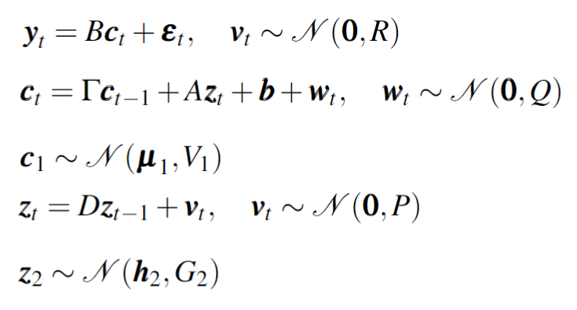
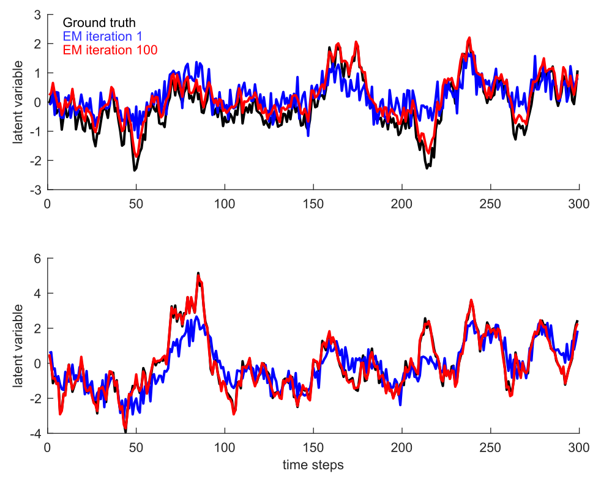
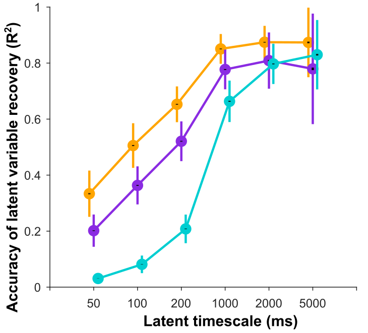

CILDS (Calcium Imaging Linear Dynamical System)
=================
Code accompanying the paper "[Dimensionality reduction of calcium-imaged neuronal population activity](https://www.biorxiv.org/content/10.1101/2022.03.11.480682v1)". Runs on MATLAB2018a.

CILDS generative model, see methods for variable definitions and dimensions.
<p align="left">

</p>

CILDS allows estimates of shared activity among neurons (i.e., the latent variables) to influence the estimates of deconvolved spiking activity, and vice versa. In other words CILDS performs deconvolution for all neurons and dimensionality reduction jointly, in a unified framework. This is in contrast to deconv-LDS, which deconvolves the activity of each neuron independently. With low-dimensional latent variables that are jointly estimated with the model of calcium decay, CILDS is better able to peer through the calcium decay to more clearly identify the shared activity among neurons, as compared to deconv-LDS and LDS applied directly on fluorescence. The differences between models are illustrated in the figure below.

<p align="center">

</p>

Getting Started
-----------
### Installation 
add CILDS and necessary folders to the search path of MATLAB

  `>> cilds_setup`

If using deconvolution, add OASIS[[1]](#1) function found in oasis_matlab folder to the search path of MATLAB. For more details, look at https://github.com/zhoupc/OASIS_matlab

  `>> oasis_setup`

Demo
-----------
### Apply CILDS on CILDS model generated data in core_cilds folder

  `>> script_cildssanitychecks`

An example of CILDS being used is 

```matlab 
[EstParam, Result] = cilds(data, RunParam);
```
where data is a structure array of trials containing N_NEURONxTIMEPOINTS of fluorescence data. RunParam is a structure containing information about the data, necessarily specifiying N_LATENT (number of latent dimensions), TRAININD (trials used for training set), and TESTIND (trials used for testing set). There are other additional parameters which are described in the cilds.m file.

Note that to use 'ldsInit' for initializing CILDS, OASIS needs to be installed.

In the given demo, a few tests are given for running CILDS. For instance, running test 5 checks that without the true parameters, the posteriors approach the ground truth latent variables with enough EM iterations (given a reasonable SNR)

Expected output (Takes about 30s): 

<p align="left">

</p>

Additional expected outputs are included in the figures folder under the header cilds_check*. 

Scripts used in paper
-----------
### Simulate data using simulation framework

  `>> script_simdata`
  
  
### Run CILDS/CIFA/LDS/deconv-LDS on simulated data

  `>> script_simdimred`
  
This performs a 2-fold cross-validation using the chosen dimensionality reduction method. For example, if using CILDS, the function called would be
```matlab 
cilds_crossvalidate(data,RunParam(iData),'zDimList',RunParam(iData).N_LATENT,...
                    'numFold',2,'maxIter',maxIter,'fileHeader',resultFile,...
                    'initParam',InitParam);
```
The example performs 2-fold cross-validation using N_LATENT number of latent dimensions, a maximum number of EM iterations as specified, saving the results in resultFile and initializing certain parameters as specified in InitParam. 

The two required parameters are data and RunParam, and the remaining parameters specified by '' are optional. data is a structure array of trials containing N_NEURONxTIMEPOINTS of fluorescence data. RunParam is a structure containing information about the data, necessarily specifiying N_LATENT (number of latent dimensions), TRAININD (trials used for training set), and TESTIND (trials used for testing set). 


### Compute R<sup>2</sup> between estimated latent variables and ground truth latent variables in given sample simulated data
Reproduces fig. 3d (see below image). Note that the process of data generation and dimensionality reduction takes awhile so the results from the run are provided in sim_stat just for plotting purposes. 

  `>> script_simstat`  
  
<p align="left">

</p>
  

References
-----------
<a id="1">[1]</a> 
Vogelstein, J. T. et al. Fast nonnegative deconvolution for spike train inference from population calcium imaging.
J. Neurophysiol. 104, 3691–3704, 10.1152/jn.01073.2009 (2010). PMID: 20554834, https://doi.org/10.1152/jn.01073.2009.


